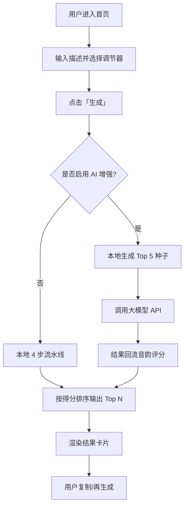

# 中文网名生成器 — 产品需求文档（PRD）

## 1. 产品概述

一款纯浏览器端的中文网名生成器：用户输入一段简短描述（行业/气质/场景），系统基于本地音韵词库生成 10-20 个音韵优美、字形讲究、有典故寓意的 2-4 字中文网名。

- **解决问题**：市面上批量起名工具只能「字典随机拼字」，结果生硬无意境、且常常需要付费解锁 AI。本工具把「音韵评分 + 主题词库 + 出处解读」做成开箱即用的本地能力。
- **目标用户**：自媒体创作者、跨境商家、电商品牌、独立游戏开发者、二次元社区用户、给项目/账号命名的产品/运营人员。
- **市场价值**：以「免费 + 本地 + 有寓意 + SEO 友好」切入，靠工具流量获取搜索长尾，再以「AI 增强（用户自带 Key）」作为可选升级。
- **MVP 范围（v0.1）**：仅做中文 2-4 字名 + 音韵评分 + 主题词库；英文、AI 增强、平台可用性检测留到 v0.2+。

## 2. 核心功能

### 2.1 用户角色
本工具无需账号体系，单一访客角色。

| 角色 | 进入方式 | 核心权限 |
|------|----------|----------|
| 访客 | 无需注册 | 全部本地功能、复制结果、可选填写自有 API Key 启用 AI 增强 |

### 2.2 功能模块

1. **首页（生成器）**：Hero 标语、输入区、调节器、生成按钮、结果列表。
2. **结果卡片**：每个名字 = 大字 + 拼音 + 寓意 + 出处 + 一键复制。
3. **AI 增强面板**（可折叠）：用户自填 API Key（OpenAI 兼容），将本地 Top 5 作为种子让大模型二次创作。
4. **常见问题（FAQ）**：内置于首页底部，服务于长尾搜索与 GEO 抓取。
5. **关于 / 隐私页**（轻量 footer 链接）：说明数据完全本地处理。

### 2.3 页面细节

| 页面 | 模块 | 功能说明 |
|------|------|----------|
| 首页 | Hero | 一句价值主张 + 简短副标题，桌面端单屏可见 |
| 首页 | 描述输入框 | placeholder 示例、行业提示词，限 40 字 |
| 首页 | 调节器 | 字数（2/3/4 字）、风格（文艺/豪迈/清新/二次元/通用）、数量（10/20） |
| 首页 | 生成按钮 | 主 CTA，按下后本地流水线 < 100ms 返回 |
| 首页 | 结果列表 | 网格卡片，每张含：汉字（大号）、拼音、声调、寓意、出处、复制按钮、音韵得分（条形/小标） |
| 首页 | AI 增强面板 | 默认折叠，含 API Key 输入、Base URL、模型名、测试按钮 |
| 首页 | FAQ 块 | 6-8 条问答，结构化数据同步输出 |
| Footer | 链接 | 关于、隐私、GitHub |

## 3. 核心流程

**本地 4 步流水线（v0.1 重点）**
1. 关键词提取：从描述中抽取主题词
2. 主题匹配：命中行业词库，召回候选字集
3. 模板组合：前缀 × 中缀 × 后缀 → 200+ 候选
4. 音韵打分排序：取 Top N

## 4. 用户界面设计

### 4.1 设计风格

- **主色**：墨黑 `#1a1a1a`（主文字）、纸白 `#fafaf7`（背景）
- **辅色**：朱砂 `#a8323a`（强调/CTA）、青灰 `#4a6670`（次要信息）、淡墨 `#e5e3dc`（分隔线）
- **风格定调**：东方留白 + 极简工具感。参考 kit.apppss.com 的卡片化结构，但加入「宋体标题 + 行楷副标」的中文韵味。**避免**：渐变紫、AI 通用模板、毛玻璃、emoji 装饰
- **字体**：
  - 标题/品牌：思源宋体 / LXGW 霞鹜文楷（在线 CDN）
  - 正文：系统无衬线（-apple-system / Inter / system-ui）
  - 数字与音韵得分：等宽（JetBrains Mono）
- **按钮**：实心朱砂主按钮（圆角 6px），描边次按钮（圆角 6px）
- **卡片**：白底 + 1px 淡墨描边，hover 时浮起 + 阴影淡出
- **图标**：lucide 风格线性图标，统一 1.5px 描边

### 4.2 页面设计概览

| 页面 | 模块 | UI 元素 |
|------|------|---------|
| 首页 | Hero | 上下结构：站点品牌 → 一句话主张 → 副标题 → 输入区 → 调节器 → CTA |
| 首页 | 结果列表 | 2 列（桌面）/ 1 列（手机）卡片网格，卡片内 6 个子区域 |
| 首页 | AI 增强面板 | 折叠抽屉，3 个表单字段 + 保存状态提示 |
| 首页 | FAQ | 紧凑型 details/summary，标题用宋体 |
| Footer | 链接 | 极简一行：© 站点名 · 关于 · 隐私 · GitHub |

### 4.3 响应式

- **桌面优先**（≥ 1024px）：双列结果，Hero 居中最大宽 720px
- **平板**（640-1023px）：单列结果，输入框全宽
- **手机**（< 640px）：所有元素堆叠，按钮高度 ≥ 44px 以适配触控

### 4.4 3D 场景

不适用（纯工具型 Web）。

## 5. SEO & GEO 优化策略

- **SSR/SSG**：使用 Nuxt 3 的 `nuxi generate` 输出静态 HTML，便于搜索引擎与 LLM 抓取完整内容
- **Meta 标签**：title / description / keywords / canonical / robots
- **Open Graph & Twitter Card**：含站点预览图、locale=zh_CN
- **JSON-LD 结构化数据**：
  - `WebApplication`（工具本体）
  - `FAQPage`（FAQ 问答）
  - `BreadcrumbList`（如有子页）
  - `Organization`（品牌）
- **语义化 HTML**：`<header>`、`<main>`、`<article>`、`<section>`、`<nav>`、`<footer>`，H1 仅出现一次
- **GEO 友好**：
  - 关键概念以可被引用的句子/列表形式呈现（如「网名生成器的评分维度」表格）
  - 站点介绍段落简洁事实化，便于 LLM 抽取
  - 提供 llms.txt 风格的「站点说明」结构
- **可访问性**：所有交互元素具备 ARIA 标签，色彩对比 ≥ AA
- **性能**：本地 JSON 词库走构建期内联/分片，首屏 < 50KB JS
- **sitemap.xml / robots.txt**：构建期生成

## 6. 非功能需求

- **隐私**：所有数据本地处理；不写 Cookie（仅在用户启用 AI 时 localStorage 存 Key）
- **离线可用**：核心生成完全离线
- **性能**：本地生成 < 100ms；首屏 LCP < 1.5s
- **浏览器兼容**：现代浏览器（Chrome 100+、Edge 100+、Safari 15+、Firefox 100+）
- **国际化**：v0.1 仅中文 UI；预留 i18n 结构

## 7. 风险与取舍

| 取舍 | 决策 | 理由 |
|------|------|------|
| 拼音库数据量 vs 包体积 | 仅内联 2000 字 + 100 主题 + 500 模板 | 平衡美感与首屏 |
| AI 增强 vs 后端 | 用户自带 Key，浏览器直连 | 零后端，零运营成本 |
| SSG vs SSR | 选 SSG | 部署到 GitHub Pages，零成本 |
| 英文支持 | v0.1 不做 | 中文词库本身是大工程，先做透 |
