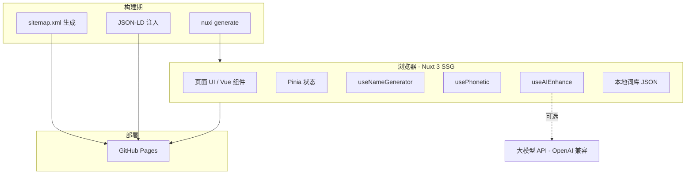

# 中文网名生成器 — 技术架构文档

## 1. 架构设计



无后端，无数据库。词库以 JSON 静态资源随构建产物发布。AI 增强为可选能力，由用户自填 API Key 浏览器直连大模型。

## 2. 技术选型

| 层级 | 选型 | 理由 |
|------|------|------|
| 框架 | Nuxt 3 (SSG) | 用户熟悉；支持 `nuxi generate` 产出静态 HTML，利于 SEO/GEO；文件路由适合单页工具 |
| 语言 | TypeScript | 类型安全；词库数据结构稳定 |
| 样式 | Tailwind CSS 3 | 用户熟悉；utility-first 便于写极简风 |
| 状态 | Pinia | Nuxt 官方推荐，比 Vuex 轻 |
| 拼音 | pinyin-pro | 轻量、覆盖全、能输出声调和韵母 |
| 词库 | JSON 静态资源 | 离线、零依赖 |
| 部署 | GitHub Pages | 用户熟悉、零成本、CDN 友好 |
| 包管理 | pnpm（优先）/ npm | 视本地环境自动选择 |
| 图标 | lucide-vue-next | 线性、统一、与极简风契合 |

## 3. 路由定义

| 路由 | 文件 | 用途 |
|------|------|------|
| `/` | `pages/index.vue` | 主生成器 + FAQ + Footer |
| `/about` | `pages/about.vue` | 关于本工具，补充 SEO 内容 |
| `/privacy` | `pages/privacy.vue` | 隐私说明（零数据收集声明） |

## 4. 目录结构

```
NameGenerator/
├── .trae/documents/
│   ├── prd.md
│   └── tech-architecture.md
├── assets/
│   ├── data/
│   │   ├── chars.json          # 2000+ 美字库
│   │   ├── themes.json         # 行业主题词库（100+）
│   │   ├── templates.json      # 500+ 名字模板
│   │   └── rhymes.json         # 韵母/声调表
│   └── css/
│       └── main.css            # Tailwind + 全局样式
├── components/
│   ├── HeroInput.vue           # Hero + 输入 + 调节器
│   ├── ResultCard.vue          # 单个结果卡片
│   ├── ResultGrid.vue          # 卡片网格
│   ├── AIEnhancePanel.vue      # AI 增强折叠面板
│   ├── FAQSection.vue          # FAQ 模块
│   └── SiteFooter.vue
├── composables/
│   ├── useNameGenerator.ts     # 4 步流水线入口
│   ├── usePhonetic.ts          # 音韵评分
│   ├── useAIEnhance.ts         # 可选 AI 增强
│   └── useSEO.ts               # 动态 head 注入
├── utils/
│   ├── tokenize.ts             # 关键词提取
│   ├── themeMatch.ts           # 主题匹配
│   └── compose.ts              # 模板组合
├── pages/
│   ├── index.vue
│   ├── about.vue
│   └── privacy.vue
├── public/
│   ├── favicon.svg
│   ├── robots.txt
│   └── og-image.png
├── nuxt.config.ts
├── tailwind.config.ts
├── tsconfig.json
└── package.json
```

## 5. 核心数据结构

```typescript
// 字库
type NameChar = {
  char: string;
  pinyin: string;
  tone: 1 | 2 | 3 | 4;
  rhyme: string;          // 韵母
  meaning: string;        // 字义
  source?: string;        // 典故
  category: string[];     // 意象分类，如 ["自然","高远"]
};

// 主题词库
type Theme = {
  id: string;
  keywords: string[];     // 触发关键词
  prefix: NameChar[];     // 候选前缀字
  middle: NameChar[];     // 候选中缀字
  suffix: NameChar[];     // 候选后缀字
  templates: string[];    // 模板如 "{prefix}{suffix}"
};

// 模板
type Template = {
  pattern: string;        // 占位符模式
  styles: string[];       // 适用风格
  examples: string[];     // 示例名
};
```

## 6. 音韵评分算法

```typescript
function scoreName(name: string): number {
  const chars = pinyin(name);
  let score = 0;

  // 1. 声调起伏 (25%)
  // 2/4 字名中 2/4 位以「上声/去声」为佳
  score += scoreToneFlow(chars) * 0.25;

  // 2. 押韵 (20%)
  // 末字韵母落在响亮集合 i/ang/u/an
  score += scoreRhyme(chars[chars.length - 1]) * 0.20;

  // 3. 平仄 (15%)
  // 末字以仄声收尾为佳
  score += scorePingZe(chars) * 0.15;

  // 4. 字形 (10%)
  score += scoreStructure(chars) * 0.10;

  // 5. 寓意 (20%)
  // 含典故/自然意象的字加分
  score += scoreMeaning(chars) * 0.20;

  // 6. 易读性 (10%)
  score += scorePronounce(chars) * 0.10;

  return Math.round(score * 100);
}
```

## 7. SEO / GEO 实现要点

- **`<head>` 配置**：在 `nuxt.config.ts` 的 `app.head` 写默认 meta，并在各 page 用 `useHead` 覆写
- **JSON-LD**：通过 `<script type="application/ld+json">` 注入 WebApplication + FAQPage
- **sitemap**：构建期由 `@nuxtjs/sitemap` 生成
- **robots.txt**：`public/robots.txt` 静态文件
- **llms.txt**：在 `public/llms.txt` 放置站点结构化说明，便于 LLM 抓取
- **canonical**：每页设置 `link rel="canonical"`

## 8. AI 增强 API

```typescript
// composables/useAIEnhance.ts
type AIConfig = {
  apiKey: string;
  baseUrl: string;   // 默认 https://api.openai.com/v1
  model: string;     // 默认 gpt-4o-mini
};

async function enhance(
  seeds: string[],
  config: AIConfig
): Promise<string[]> {
  const prompt = `基于以下名字的意境与音韵，生成 10 个类似风格但更新颖的中文 2-4 字网名，仅返回 JSON 数组：${JSON.stringify(seeds)}`;
  const res = await fetch(`${config.baseUrl}/chat/completions`, {
    method: 'POST',
    headers: {
      'Authorization': `Bearer ${config.apiKey}`,
      'Content-Type': 'application/json'
    },
    body: JSON.stringify({
      model: config.model,
      messages: [{ role: 'user', content: prompt }],
      temperature: 0.9
    })
  });
  // 解析 + 音韵复评
  return parseAndRescore(res);
}
```

- Key 仅存 `localStorage`，不外发
- 请求失败时回退到纯本地结果 + 提示
- 支持自定义 baseUrl，兼容 OpenAI / Moonshot / DeepSeek / Ollama 等

## 9. 构建与部署

- `pnpm dev` — 本地开发（端口 3000）
- `pnpm generate` — 静态构建，输出到 `.output/public/`
- 部署：把 `.output/public` 推送到 `gh-pages` 分支即可
- 域名：暂用 `https://<user>.github.io/NameGenerator/`，后续可绑自定义域名

## 10. 测试策略

- **单元测试（Vitest）**：`utils/*` 与 `composables/usePhonetic.ts` 覆盖关键算法
- **手动验收**：浏览器中输入 5 个不同描述（电商/二次元/山水/科技/中性），结果均符合预期
- **Lighthouse**：性能 ≥ 90，SEO ≥ 95，可访问性 ≥ 95
- **结构化数据校验**：Google Rich Results Test 通过
